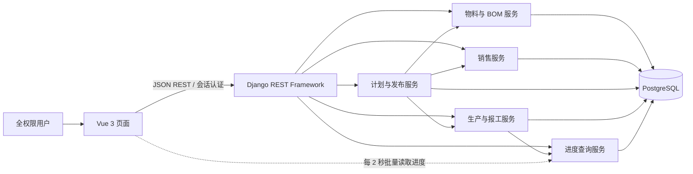

# 02 架构设计

版本：0.3｜2026-10-09｜开发使用 .venv，本机展示部署采用单容器。

## 1. 总体结构

采用模块化单体。Django 承担领域规则、计划计算及事务，Vue 提供业务页面，PostgreSQL 保存事实数据。展示系统暂不引入任务队列、缓存服务、微服务或外部 APS 引擎。



该图为系统结构图，UML 类图、时序图和状态图见 [06](06-uml.md)。

## 2. 技术选型与依赖策略

| 层 | 计划选型 | 用途 |
| --- | --- | --- |
| 后端 | Python 3.12 + Django 5.2 LTS + Django REST Framework | 稳定版本系列、ORM、事务、REST |
| 数据库 | PostgreSQL 17 | 关系数据、行锁、约束、JSONB 快照、递归查询 |
| 前端 | Vue 3 + TypeScript + Vite + Vue Router + Pinia | 页面、路由和登录/筛选状态 |
| UI | Element Plus | 表格、表单、弹窗、树形 BOM、进度条 |
| 测试 | pytest / pytest-django；Vitest；Playwright | 算法、数据库、组件、关键端到端场景 |
| 开发环境 | 项目根目录 .venv + 本机 Node.js / PostgreSQL | 后端依赖隔离，前后端可分别调试 |
| 本机部署 | 单个 Docker 容器：Django/Gunicorn + Vue静态产物/WhiteNoise + PostgreSQL | 一个镜像、一个容器、一个数据卷、一个网页端口 |

此处是建议版本系列，不声称是最新版本。Django 5.2 的 LTS 定位与 Python 3.12 支持依据[官方发布说明](https://docs.djangoproject.com/en/5.2/releases/5.2/)；Vue 3 的组件化设计依据[官方指南](https://vuejs.org/guide/introduction.html)。在工程初始化阶段核对各依赖兼容性并锁定具体补丁版、提交锁文件。当前工作区尚无应用和依赖环境验证。

## 3. 计划目录（尚未创建）

```text
Neo_APS/
  doc/                         # 本次已交付
  .venv/                       # 开发时创建，不提交、不复制到镜像
  backend/
    config/                    # 配置、路由
    apps/accounts/             # 单用户登录
    apps/catalog/              # Item、BOM
    apps/sales/                # 销售订单
    apps/planning/             # 展开、排序、方案、发布
    apps/production/           # 生产单、报工、状态机
    apps/common/               # 幂等、错误结构、审计
    tests/
  frontend/src/
    api/ components/ router/ stores/
    views/{catalog,sales,planning,production,dashboard}/
  deploy/                      # 单容器Dockerfile、启动/健康/备份脚本、环境示例
```

## 4. 模块职责

- Serializer 校验字段格式；领域 Service 校验跨表规则并执行事务；模型约束保存基础不变量。前端校验用于交互，不作为唯一防线。
- `BomService` 负责版本发布、合法类型、无环校验、有效 BOM 解析及批量读取。
- `PlanningService` 按来源展开 BOM，再跨订单合并任务；保留需求分配、共享依赖及最高来源等级，输出五级建议顺序，不直接创建已发布单。
- `PlanPublishService` 锁全部来源销售行，验证快照与占用，原子生成生产批次、合并生产单、分配及原料。
- `ProductionService` 提供手工生产草稿 CRUD、依赖检查和状态转换；手工草稿也使用同一 BOM 展开器。
- `ReportingService` 负责幂等报工、按冻结等级依次回分、原回分冲销、数量守恒和审计。
- `ProgressQueryService` 仅从 SALE 分配批量聚合销售进度，COMPONENT 显示内部进度，不将生产单总量复制到每个订单。

## 5. 并发、一致性与历史

1. 销售单、BOM 草稿、建议批次和生产单使用 `revision` 乐观锁；客户端提交当前 revision，过期返回 409。
2. 所有业务写事务按“涉及时先 BOM 图锁 → 销售订单ID → 销售行ID → 计划ID → 生产批次ID → 生产单ID → 分配ID → 报告ID”固定顺序加锁。手工发布也遵循同一路径。涉及多个来源时锁定全部来源。
3. 锁内重新计算剩余需求。多个建议批次争用同一需求时，第二个发布请求必须失败或重新生成，不允许静默缩量。
4. 计划生成使用一致性快照，记录销售revision、BOM映射、物料revision和已发布 SALE 分配占用指纹；发布时全部验证。普通报工不改变分配计划量；销售等级更新不改变已发布分配冻结键。
5. BOM 发布及计划发布共用事务级 BOM 图锁；演示规模下使用一个 PostgreSQL advisory transaction lock 串行化 BOM 图变更，防止两个并发版本分别通过检查却共同形成环。涉及 BOM 的事务先拿图锁，再拿业务行锁。
6. 已发布 BOM 和生产快照不可覆盖；外键默认 `PROTECT/RESTRICT`。仅无历史关联的草稿允许级联删除其明细。
7. 展示规模下以生产批次行为执行互斥锁，报工、开工、冲销、取消串行验证该批次依赖。先读取已冻结的来源集合并锁全部来源销售订单/行，再锁批次及具体记录；草稿来源变化以revision重新校验。报告、回分、累计量与销售状态必须同事务提交，避免共享半成品被重复使用或并发冲销。
8. 幂等键同载荷返回原结果，不同载荷409；先查成功幂等记录再校验旧revision。发布中途失败不能留下部分任务或分配。
9. 取消先返回按任务图计算的完整关联组件、所有订单释放量和版本指纹；确认操作在上述锁内复核，存在开工历史或预览过期则失败。禁止销售取消自动连带取消其他订单。

## 6. 进度自动更新

首版采用可见页面每 2 秒批量请求进度的方式，报工页面成功后立即刷新本页。销售列表按可见订单批量查询；安排页按可见生产单批量查询。请求中断时不启动叠加轮询，最多一个请求在途；失败退避到 5/10 秒并显示最后更新时间。

服务端返回 `server_time`、状态、计划量、合格累计量与 revision，前端丢弃旧响应。重新聚焦页面立即全量刷新。正常演示目标为 3 秒内可见，需用两浏览器页签验收。若 A03 改为真正推送，单独设计 SSE/WebSocket、断线补偿和连接管理；不能把短轮询声称为毫秒级实时。

## 7. 部署与运维边界

开发使用项目 `.venv` 运行Django、本机Node运行Vite、本机PostgreSQL独立开发库。本机部署为单个Docker容器：Vue构建产物由Django/WhiteNoise提供，Gunicorn服务页面与API，PostgreSQL在同容器内部运行；入口脚本管理进程和退出，使用 --init。网页映射127.0.0.1:8080，数据库不对宿主机暴露。

PostgreSQL数据保存在一个Docker命名卷，凭据由环境变量提供，活跃数据库文件不放在OneDrive项目目录。数据库时间保存UTC，前端按Asia/Shanghai显示，交期为日期。开发虚拟环境、源代码和凭据不打入运行镜像。部署流程、停止/恢复与验收见[09开发与部署计划](09-development-deployment.md)。

初始化命令创建一个全权限演示账号，密码由环境变量或交互输入；不提供公共注册。提供迁移、演示种子、健康检查、备份和恢复说明。数据清空命令需要显式参数并标记只限演示数据库，不在启动时自动执行。
