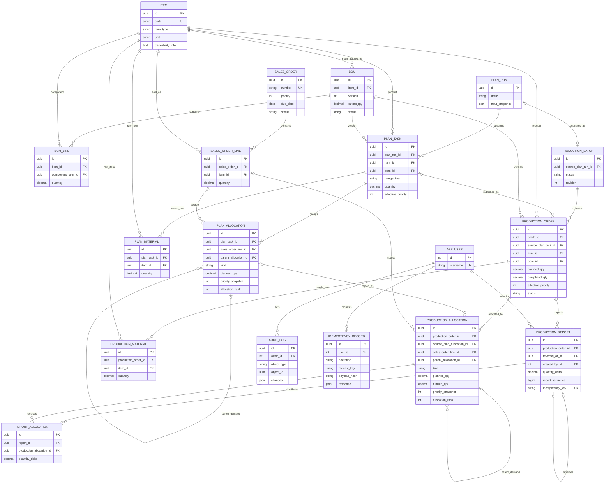

# 03 数据库设计

版本：0.2｜2026-10-09。采用跨订单合并任务与需求分配模型。

这是目标设计基线。实际实现保留既有 bigint 主键，候选任务/来源/原料采用 Plan JSONB 聚合；正式生产来源与报工采用外键表。最终 ER、字段和原因见[13 实现设计](13-implementation-design.md)。

## 1. 建模原则

BOM 是无固定层级的 DAG。销售行按路径展开为需求节点；多个节点汇入同一生产任务，任务可供应多个父任务。生产单不再保存单一 sales_order_line_id 或 parent_order_id；来源与制造依赖由分配表表达。

kind 为 SALE（直接销售）、COMPONENT（内部组件）、STANDALONE（独立生产）。生产单计划量等于所属分配计划量之和，销售进度只统计 SALE 收到的合格量。供给任务到消耗任务的边从组件分配及其父分配推导并去重，不另存重复依赖表。

业务主键 UUID，Django 用户沿用内置整数主键；数量 numeric(20,6)，时间 timestamptz；可编辑聚合实体含 created_at、updated_at、revision。`?` 表示可空，可选文本默认空串。

## 2. ER 图



BOM/销售草稿可无明细，发布/确认时至少一行；发布任务至少一条分配。图为核心字段，补充字段如下。审计通用对象引用保留被删除草稿历史，不用强外键。

## 3. 主数据与需求

| 表 | 字段 | 规则 |
| --- | --- | --- |
| item | code / name / item_type | 编码 varchar(64) 唯一，名称 varchar(200)；FINISHED / SEMI / RAW |
| item | unit / traceability_info / is_active | varchar(20)、text、boolean；三类都有溯源信息，已引用后类型/单位冻结 |
| bom | item_id / version / output_qty | 仅成品/半成品；(item_id,version) 唯一；基准产量>0 |
| bom | status / published_at? | DRAFT / ACTIVE / RETIRED；同物料至多一 ACTIVE，生效后内容冻结 |
| bom_line | bom_id / component_item_id / quantity / line_no | 仅 SEMI/RAW；数量>0；每 BOM 组件唯一、行号唯一 |
| sales_order | number / customer_name / priority / due_date? | 唯一编号、客户文字、smallint 1～5 默认3、date |
| sales_order | status / notes | DRAFT / CONFIRMED / COMPLETED / CANCELLED；备注 text |
| sales_order_line | sales_order_id / item_id / line_no / quantity | 仅 FINISHED/SEMI；单内行号唯一，数量>0 |

销售行完成量由 SALE 分配聚合，不单独缓存；销售单状态在报工/冲销事务中重算，可早于共享生产单完成。

## 4. 候选方案

| 表 | 字段 | 规则 |
| --- | --- | --- |
| plan_run | status / input_snapshot | DRAFT / PUBLISHED / STALE / DISCARDED；jsonb 保存输入、占用指纹、revision 与 BOM 映射 |
| plan_run | algorithm_version / requires_sequence_review / published_at? | cross-order-priority-v2；重建后要求复核顺序；timestamptz |
| plan_task | plan_run_id / item_id / bom_id / merge_key | FK；(plan_run_id,merge_key) 唯一，合并键见04 |
| plan_task | quantity / effective_priority | 分配计划量之和；最高来源等级，即 min(priority_snapshot) |
| plan_task | suggested_sequence / manual_sequence? / adjustment_reason | 建议、人工顺序、覆盖原因 |
| plan_task | target_start? / target_end? / line_label / notes | 目标日期、产线文字、备注 |
| plan_task | bom_snapshot / manufacturing_signature | 直接 BOM、单位、溯源及子版本映射 jsonb；完整制造快照摘要 |
| plan_allocation | plan_task_id / kind / planned_qty | FK；SALE / COMPONENT / STANDALONE；数量>0 |
| plan_allocation | sales_order_line_id? / parent_allocation_id? | 用途约束见下文 |
| plan_allocation | path_key | 销售行或独立根标识 + BOM 行路径；服务校验同方案唯一 |
| plan_allocation | priority_snapshot / due_date_snapshot? / source_created_at / source_key | 冻结等级、交期、创建时间和订单ID/行号/路径；独立需求取手工等级、草稿时间、独立根ID |
| plan_allocation | allocation_rank | 每任务唯一正整数，按完整来源键生成 |
| plan_material | plan_task_id / item_id / quantity / traceability_snapshot | 仅 RAW；各来源直接量逐边舍入后相加；同任务同原料唯一 |

SALE 的 sales_order_line 必填、parent为空，任务产品匹配销售产品；STANDALONE 两者均为空；COMPONENT 的 parent必填，sales_order_line继承父来源（允许为空），产品必须是父需求 BOM 中半成品。父子同方案，数量符合展开公式，禁止自引用和环。

组件分配的任务为供给任务，其 parent_allocation 的任务为消耗任务；按任务对去重得到依赖。一张任务有多个消耗父任务合法，每个分配仍能追到唯一 SALE/STANDALONE 根。

## 5. 生产事实及回分

| 表 | 字段 | 规则 |
| --- | --- | --- |
| production_batch | source_plan_run_id? / status / revision | 来源方案非空唯一；手工为空；DRAFT / RELEASED / CANCELLED 表示发布生命周期 |
| production_order | batch_id / number / source_plan_task_id? | 批次FK、唯一单号、非空来源任务唯一 |
| production_order | item_id / bom_id / merge_key / manufacturing_signature / bom_snapshot | 复制候选字段；发布后冻结 |
| production_order | planned_qty / completed_qty / effective_priority | 正计划量、默认0合格量、等级1～5；0≤completed≤planned |
| production_order | status / dispatch_sequence / suggested_sequence / adjustment_reason | DRAFT / RELEASED / IN_PROGRESS / PAUSED / COMPLETED / CANCELLED；全局顺序、原建议、调整原因 |
| production_order | target_start? / target_end? / line_label / notes | 人工安排字段 |
| production_order | started_at? / completed_at? / cancelled_at? | 首次开工永久保留；冲销完成单清空completed_at |
| production_allocation | production_order_id / source_plan_allocation_id? | FK；非空来源分配唯一 |
| production_allocation | kind / sales_order_line_id? / parent_allocation_id? / path_key | 同候选用途约束，父子同生产批次 |
| production_allocation | planned_qty / fulfilled_qty | 正计划量、默认0已回分合格量；0≤fulfilled≤planned |
| production_allocation | priority_snapshot / due_date_snapshot? / source_created_at / source_key / allocation_rank | 冻结排序依据；(production_order_id,allocation_rank)唯一 |
| production_material | production_order_id / item_id / quantity / traceability_snapshot | 同候选原料，展示需求不记库存 |
| production_report | production_order_id / quantity_delta / report_sequence | 正报工或负冲销；每单递增且单内唯一序号 |
| production_report | reversal_of_id? / idempotency_key / reason / created_by_id / created_at | 冲销指向原正报告且唯一；幂等UUID唯一；原因、用户FK、时间 |
| report_allocation | report_id / production_allocation_id / quantity_delta | 联合唯一；报告与分配属同一生产单；普通回分正数，冲销等额负数 |
| audit_log | object_type / object_id / action / changes / actor_id / created_at | 对象、动作、jsonb前后值/原因/request_id、用户、时间 |
| idempotency_record | user_id / operation / request_key / payload_hash / response / http_status | 前三字段联合唯一，响应与业务同事务提交 |

批次部分关联组件取消时仍为 RELEASED，全部生产单取消才为 CANCELLED；完成状态从各单聚合。发布后的依赖图冻结，便于确定取消及并发锁范围。

```text
order.planned_qty = SUM(its allocations.planned_qty)
order.completed_qty = SUM(its reports.quantity_delta)
                    = SUM(its allocations.fulfilled_qty)
allocation.fulfilled_qty = SUM(its report_allocations.quantity_delta)
report.quantity_delta = SUM(its report_allocations.quantity_delta)
```

上述数量均按本任务产品单位计，组件数不能与父产品数相加。ReportAllocation 为不可覆盖事实，缓存同事务维护；冲销按原回分反向记录，禁止按当前等级转移已完成量。

## 6. 约束、索引与历史保护

数据库 CHECK 保证枚举、等级1～5、正计划量/累计范围及用途空值组合；FK/UNIQUE 保证引用、编号、幂等和来源唯一；BOM 使用 `(item_id) WHERE status='ACTIVE'` 部分唯一索引。总量、产品匹配、同批次、无环、回分次序等跨表规则由锁内领域服务校验。所有 API/Admin/管理命令复用服务，不假定 clean() 自动执行。

分配索引：parent_allocation_id、sales_order_line_id、`(sales_order_line_id,kind)`；生产分配 `(production_order_id,allocation_rank)`；生产单 `(batch_id,status)`、`(status,effective_priority,dispatch_sequence)`；报工 `(production_order_id,report_sequence)`；回分 `(production_allocation_id,report_id)`。保留物料编号、反向 BOM 组件、销售状态/等级/交期、候选任务顺序、审计对象时间索引。

发布锁内按 SALE 分配占用每行需求，不能把合并总量分别扣给每个订单。报工/冲销锁同批次及全部来源订单，原子更新报告、回分、缓存和销售状态；锁顺序见[架构设计](02-architecture.md)。

已发布 BOM、分配计划量/来源键、快照和报工事实不可直接改写。FK默认 PROTECT/RESTRICT，无引用草稿可删明细。取消共享任务必须预览整个关联组件和受影响销售单，不按单一销售行级联删除。具体见[算法规则](04-scheduling.md)。

当前无实际数据库迁移，实现时直接使用v0.2模型，不建旧版单来源字段。Django migrations 在 PostgreSQL 上验证约束和锁。深层查询参考已有调研的[PostgreSQL递归查询](https://www.postgresql.org/docs/current/queries-with.html)，查询防环且不限制业务层级。
