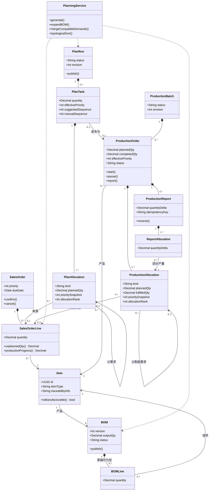
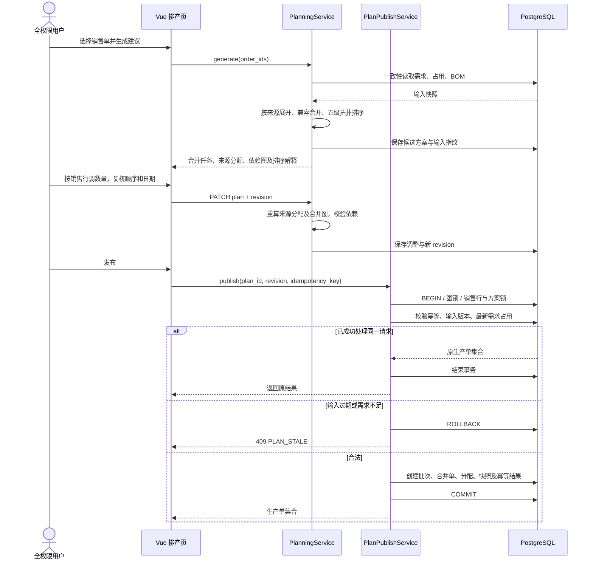
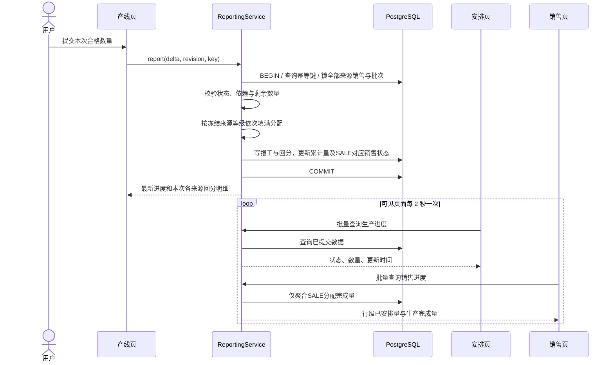
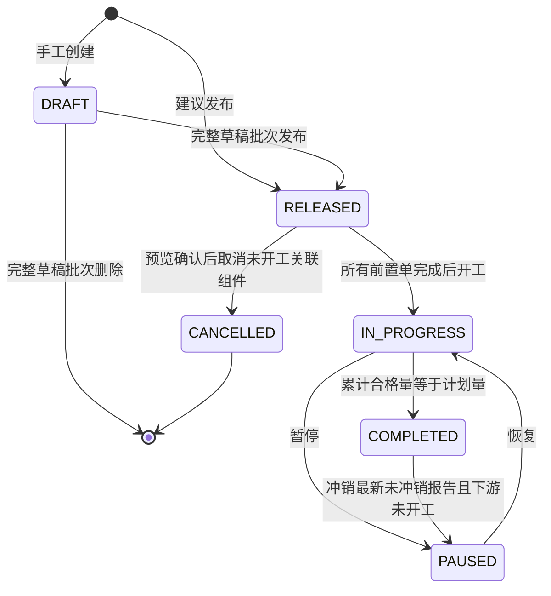
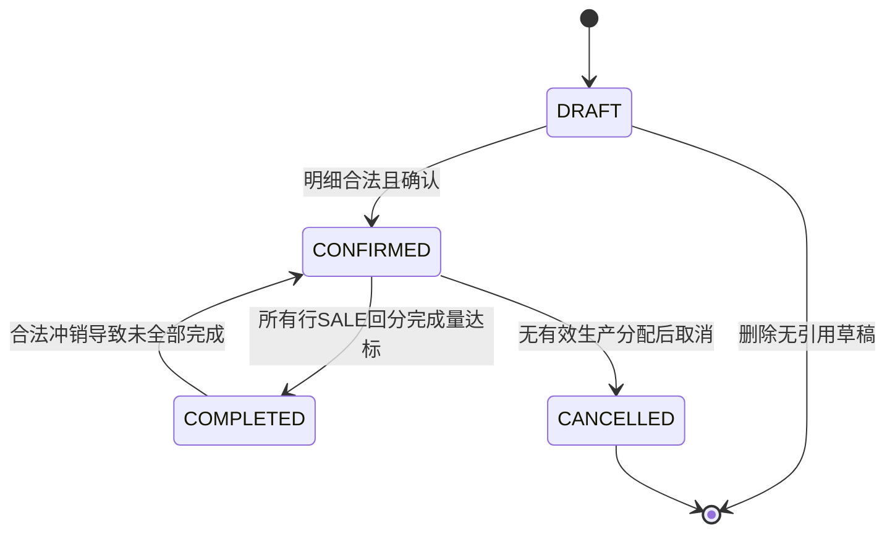
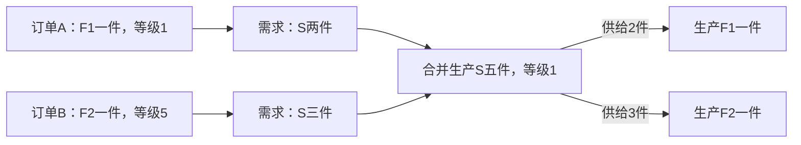

# 06 UML 设计

版本：0.2｜2026-10-09｜已同步合并任务、多来源分配与回分关系。

本文件是设计基线，最终实体/服务及状态图见[13 实现设计](13-implementation-design.md)。所有 Mermaid 图已校验并导出 SVG/PNG。

本文件提供标准 UML 类图、时序图、状态图的 Mermaid 源码；用例图使用 PlantUML。系统结构图在 [02](02-architecture.md)，数据库 ER 图在 [03](03-database.md)，两者不冒充 UML 图。

## 1. 用例模型

标准用例图源文件：[diagrams/use-cases.puml](diagrams/use-cases.puml)。唯一参与者为全权限用户，分别访问销售、安排和产线业务视图。

| 用例 | 前置条件 | 主成功结果 |
| --- | --- | --- |
| UC-01 维护物料与 BOM | 已登录 | 保存合法分类、组件、溯源，发布无环 BOM |
| UC-02 管理销售单 | 有成品/半成品 | 草稿 CRUD 并确认需求 |
| UC-03 跨单合并与调整建议 | 销售已确认、BOM 完整 | 合并兼容需求，保留来源分配并按五级排序 |
| UC-04 发布生产安排 | 建议未过期、依赖合法 | 原子创建任务图和分配，按SALE数量占用需求 |
| UC-05 手工管理生产单 | 有合法可制造产品 | 完成生产草稿 CRUD 并可发布 |
| UC-06 执行生产与报工 | 依赖完成、合法状态 | 按冻结等级回分产量并更新各销售进度 |
| UC-07 查询进度与历史 | 已登录 | 查看SALE回分量、组件用途、报工及溯源快照 |
| UC-08 预览共享生产取消 | 完整关联组件均未开工 | 显示所有受影响订单，确认后释放分配占用 |

## 2. 领域类图

类上的操作表达领域行为，具体实现统一进入服务层，不意味着让 Django 模型同时承担 API 和事务编排。

## 3. 生成、调整与发布时序图

## 4. 报工反馈时序图

## 5. 生产单状态图

正常报工为 IN_PROGRESS 的内部动作；未达到计划数量时状态不变。COMPLETED 保留历史，可在符合约束时冲销，因此不画不可返回的终态。PAUSED 仍占用销售需求。

## 6. 销售单状态图

“未安排、部分安排、已安排”和“未开始、生产中、部分完成”是依据行级聚合得到的展示标签，不再创建多个容易相互矛盾的持久化状态字段。

## 7. 共享任务依赖示意（业务图）

供给依赖由 COMPONENT 分配及其父分配推导；S可有多个后续任务，不能在生产单上只保存一个父ID。
