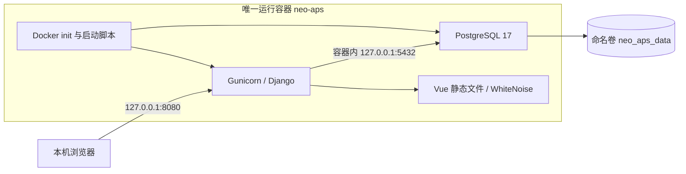

# 09 开发环境与单容器部署计划

版本：0.4｜2026-10-09｜.venv、依赖、开发服务和单容器已准备并实测；业务功能仍待实现。实际版本与检查见[10](10-environment-ready.md)。

## 1. 部署决定

开发时，Django 在项目根目录的 `.venv` 中运行，Vue 使用本机 Node.js 工具链；数据库使用本机 PostgreSQL 17 的独立开发库。本机展示部署使用**一个镜像、一个运行容器、一个数据卷、一个网页端口**，Vue 构建产物、Django 和 PostgreSQL 全部装在同一容器中。

“单一 Docker 实例”在本计划中明确指一个运行容器，而非一个 Compose 项目里运行三个容器。部署命令使用 docker build / docker run。容器内由简短启动脚本管理 PostgreSQL 与 Gunicorn 两组进程；Vue 在构建时转成静态文件，运行时不启动 Node/Vite。

## 2. 开发环境

| 项目 | 开发约定 |
| --- | --- |
| Python | 沿用计划 Python 3.12 系列，开发与镜像一致；实现时锁定补丁版 |
| 虚拟环境 | 根目录 `.venv`，所有后端安装、迁移、测试和启动使用其中的 Python |
| 前端 | 本机安装与选定 Vite 版本兼容的 Node.js LTS，版本写入工具配置；使用 package-lock.json 和 npm ci |
| 数据库 | 本机 PostgreSQL 17，使用 neo_aps_dev；集成测试使用独立测试库，不连部署库 |
| 服务地址 | Django 127.0.0.1:8000，Vite 127.0.0.1:5173；Vite 将 /api 转发到 Django |
| 配置 | `.env.dev` 保存本机连接配置，应用显式加载或由启动脚本注入；只提交 `.env.dev.example` |

实际已安装项目内Python3.12.15、Node24.21.0和PostgreSQL17.11；系统默认Python3.14保留。开发库端口15432，数据保存在LocalAppData。工具仅对当前终端添加PATH，不修改系统配置；具体见[项目README](../README.md)。

环境已建立。需要前台调试时先停止脚本管理的开发服务；在仓库根目录使用PowerShell，以下venv创建步骤仅在环境不存在时执行：

```powershell
. .\scripts\use-tools.ps1
if (-not (Test-Path .venv)) { & .\.tools\python\cpython-3.12-windows-x86_64-none\python.exe -m venv .venv }
.\.venv\Scripts\python.exe -m pip install -r backend/requirements-dev.txt
.\.venv\Scripts\python.exe backend/manage.py migrate
.\.venv\Scripts\python.exe backend/manage.py runserver 127.0.0.1:8000
```

Python3.12位于项目.tools而非系统py注册版本。可以激活.venv或显式指定解释器，后者无需修改系统执行策略。创建方式依据[Python venv文档](https://docs.python.org/3.12/library/venv.html)。日常启动优先使用scripts/dev.ps1，不重复创建环境。

另一个终端启动前端（同样要求先生成前端工程）：

```powershell
Set-Location frontend
npm ci
npm run dev -- --host 127.0.0.1
```

开发库账号拥有其开发库权限；需要运行数据库测试时允许创建测试数据库。部署账号不需要该测试权限。开发与部署数据分开，不自动复制或相互覆盖。

## 3. 单容器拓扑



运行镜像包含 Python 3.12、PostgreSQL 17、应用及前端构建产物。计划以 Python 3.12 Debian 系镜像为运行基础，通过 PostgreSQL 官方 Debian 软件源安装指定主版本；实现时固定基础镜像摘要与依赖版本，并禁用安装阶段自动创建的默认数据库集群，统一由启动脚本初始化。软件源依据 [PostgreSQL Debian 安装说明](https://www.postgresql.org/download/linux/debian/)。

Dockerfile 使用 Node 构建阶段运行 npm ci / npm run build，将 dist 复制进最终运行镜像。多阶段构建只产生一个最终应用镜像和一个运行容器，不增加常驻服务。Windows `.venv` 不复制到 Linux；容器内重新按后端锁定依赖安装。

Vue 的带哈希静态资源由 WhiteNoise 提供，Django 返回 SPA 的 index 页面，Gunicorn 监听容器 0.0.0.0:8000。Vue 路由刷新由明确的页面路由回退处理；未知 /api 或缺失静态文件仍返回正确 404，不错误返回 index。WhiteNoise 的静态资源收集配置依据[官方 Django 指南](https://whitenoise.readthedocs.io/en/stable/django.html)。

PostgreSQL 只监听容器本地地址，不映射宿主机 5432；网页只映射本机 8080。同域访问页面和 API，登录继续使用会话与 CSRF。

## 4. 启动、停止与持久化

启动脚本按顺序执行：

1. 检查必要配置和数据目录权限。入口可为准备卷权限短暂使用 root，PostgreSQL 以 postgres 用户运行，Web 以独立应用用户运行。
2. 将 PGDATA 固定为 `/var/lib/neo-aps/postgres`，挂载卷根目录为 `/var/lib/neo-aps`。只有首次空目录才 initdb；已有有效 PG_VERSION 则复用。非空但缺标识/版本不匹配时退出报错，不能覆盖重建。
3. 启动 PostgreSQL 并等待就绪；首次创建应用数据库与非超级用户的应用账号，密码从环境读取，TCP 使用密码认证。配置凭据与已有数据不匹配时报告错误，不自动重置密码。
4. 执行 Django migrate，失败则结束启动；生产静态文件在镜像构建时准备，不在每次启动重新编译前端。
5. 启动 Gunicorn，启动脚本持续等待两组服务进程。任一关键服务退出则停止另一个并以非零状态退出容器，交由 Docker 重启策略处理。
6. 收到停止信号先让 Web 停止接收并完成请求，再使用 PostgreSQL fast shutdown 正常退出；整个过程在60秒停止宽限期内完成。不得只用后台启动加无限 sleep。

使用 docker run 的 `--init` 处理子进程回收，启动脚本负责信号转发和两组服务退出联动；实现方式参考 [Docker 多进程容器文档](https://docs.docker.com/engine/containers/multi-service_container/)。不另引入进程管理服务或编排系统。

命名卷独立于容器生命周期；重建同版本数据库容器时复用该卷，依据 [Docker 卷文档](https://docs.docker.com/engine/storage/volumes/)。数据库活跃文件不放在当前 OneDrive 项目目录。开发代码可继续留在工作区，部署容器不挂载源代码。

## 5. 已实现的环境文件与配置

```text
Neo_APS/
  .venv/                       # 本机后端开发环境，忽略提交
  .env.dev.example              # 开发配置样例
  .gitignore                   # 排除虚拟环境、凭据、构建和备份
  .dockerignore                # 排除 .venv、node_modules、.env*、备份、.git
  deploy/
    Dockerfile                 # 多阶段构建，最终一个镜像
    entrypoint.sh              # 初始化、迁移、进程启动和停止
    healthcheck.py             # HTTP与数据库就绪检查
    backup.sh                  # 容器内生成逻辑备份
    restore.sh                 # 受控恢复到明确指定的空库
    .env.example               # 部署配置样例
```

实际 `.env`、`.env.dev`、`.venv`、node_modules、数据库文件和备份都不进版本库/镜像上下文。示例配置放占位符，构建过程不需要运行数据库、也不接收真实部署密码。

部署配置保持最少：DJANGO_SECRET_KEY、DJANGO_ALLOWED_HOSTS=localhost,127.0.0.1、DB_NAME=neo_aps、DB_USER=neo_aps、DB_PASSWORD；DEBUG 固定关闭，数据库地址固定容器本地。密码和 Secret Key 首次部署生成并保持，日志不输出其值。

## 6. 本机部署操作草案

Dockerfile、启动脚本和镜像已实现，neo-aps容器已运行；日常用scripts/deploy.ps1管理。以下为已采用的构建/首次启动命令，已有容器时不要重复docker run。Docker Desktop需运行Linux容器，实际配置deploy/.env已生成：

```powershell
docker build -f deploy/Dockerfile -t neo-aps:0.1.0 .
docker volume create neo_aps_data
docker run -d --name neo-aps --init --restart unless-stopped --stop-timeout 60 --env-file deploy/.env -p 127.0.0.1:8080:8000 --mount type=volume,source=neo_aps_data,target=/var/lib/neo-aps --log-opt max-size=10m --log-opt max-file=3 neo-aps:0.1.0
docker logs --tail 100 neo-aps
```

已通过provision_admin.py创建唯一admin，随机凭据保存到.tools/access.docker.json，重启不重置。若在全新空环境需要手工创建，可在健康状态就绪后使用：

```powershell
docker exec -it --user neoapp neo-aps python /app/backend/manage.py createsuperuser
```

打开 `http://127.0.0.1:8080`。单账号初始化只执行一次，普通重启不重建账号、不重置密码、不清空数据。演示种子由显式命令加载，不在启动时自动加载。

日常只需以下命令：

```powershell
docker stop neo-aps
docker start neo-aps
docker logs --tail 100 neo-aps
docker inspect --format '{{.State.Health.Status}}' neo-aps
```

宿主机重启后需 Docker Desktop/引擎先启动，容器的 unless-stopped 策略才生效；此前手工停止的容器使用 docker start 恢复。默认仅本机可访问，不为局域网发布额外配置。

## 7. 健康检查、备份与更新

`/api/v1/health/` 检查应用就绪和一次数据库 SELECT 1，返回最少信息；不泄漏连接配置。镜像 HEALTHCHECK 调用它，设置合理启动宽限期。进程退出由入口联动退出并触发重启；仅标记 unhealthy 不会自动使 Docker 重启，持续不健康时查看日志再处理。

数据库使用 pg_dump 的 custom 格式逻辑备份，由 backup.sh 在容器内使用配置凭据生成，再通过 docker cp 导出，避免 PowerShell 文本重定向损坏二进制备份：

```powershell
New-Item -ItemType Directory -Force -Path backups
docker exec neo-aps /app/deploy/backup.sh /tmp/neo-aps.dump
docker cp neo-aps:/tmp/neo-aps.dump ./backups/neo-aps-before-upgrade.dump
```

命名卷用于持久化，导出的 dump 用于备份。需在首次验收和升级前验证备份可读，并在恢复演练中核对销售单、生产单、分配与报工数量。

升级步骤：停止业务操作 → 备份并导出 → 构建有版本号的新镜像 → 停止并替换旧应用容器 → 挂载原命名卷启动 → 自动迁移与健康检查 → 跑关键演示。全程最多一个运行应用容器；替换期间允许短暂停机，镜像版本和数据库主版本保持明确记录。

失败回退：未改变数据库结构或确认向后兼容时可换回旧镜像；不兼容迁移不能仅换镜像。应停止失败容器，保留原卷，在新空卷里用旧版本启动维护模式（只启动数据库，禁止Web和自动迁移），由 restore.sh 将备份恢复到指定空库，再正常启动旧应用。维护模式沿用同一镜像与容器，不另加服务。PostgreSQL 主版本不随普通应用升级更换。

## 8. 部署验收

| 编号 | 预期结果 |
| --- | --- |
| D01 | 后端 sys.executable 指向项目 .venv；安装和测试不修改全局 Python 依赖 |
| D02 | 单一容器 neo-aps 提供Vue页面、Django API及PostgreSQL，宿主机只开放本机8080 |
| D03 | 登录、销售/生产CRUD、跨订单合并、五级排序、报工回分及自动刷新完成闭环 |
| D04 | 容器停止、启动及重建后，使用同一命名卷的数据和账号保持；无重复种子或重置 |
| D05 | 任一关键服务退出时容器整体退出；停止信号可正常关闭数据库；错误初始化不清空卷 |
| D06 | 健康检查能识别数据库不可用；Vue深链接刷新正常，未知API/静态资源返回404 |
| D07 | 导出的备份可在维护模式恢复，关键数量一致；凭据、Windows虚拟环境不在镜像中 |

本机与单容器环境已准备，数据库/页面、重启和备份恢复已验证，具体结果见10。D03完整业务闭环仍待业务实现后验收；环境测试不代替销售/排产业务验收。
