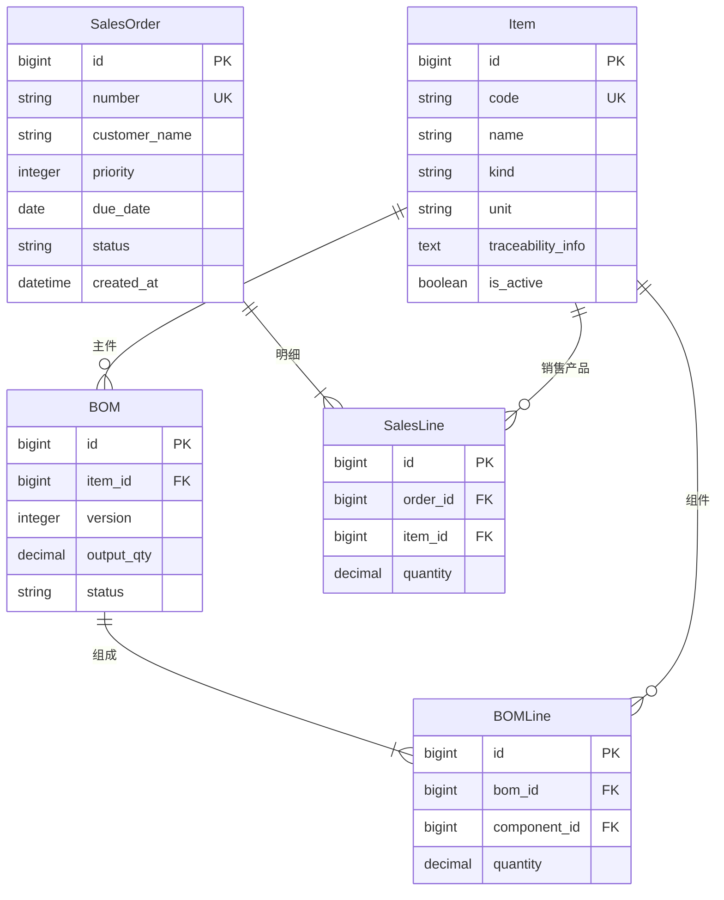
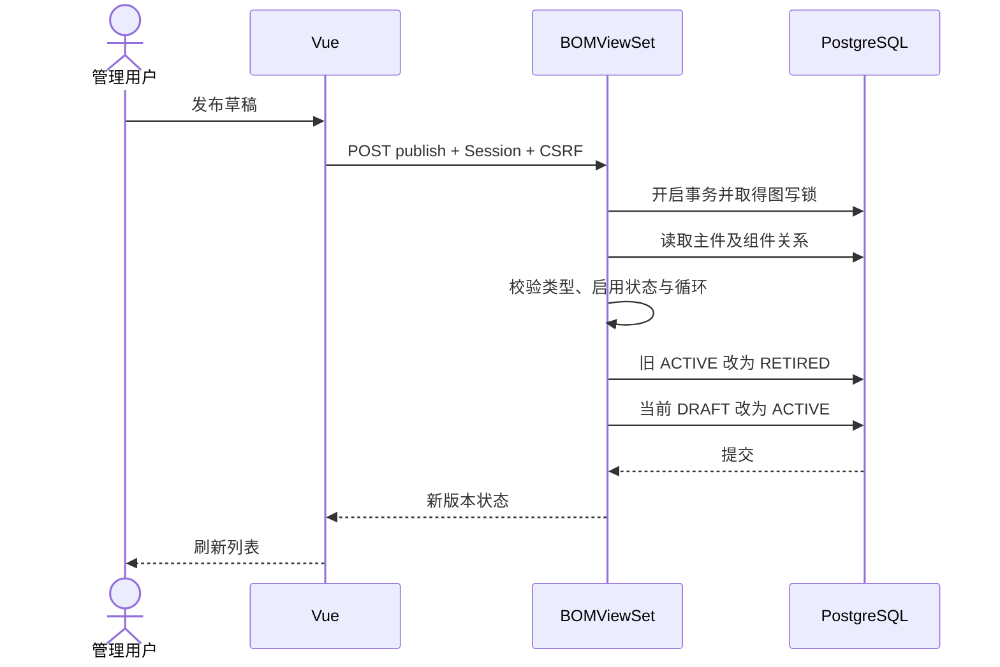

# 第一批业务实现与接续记录

日期：2026-10-09。此记录描述实际代码；01～07 是目标设计，尚未全部实现。

**接续工作现已完成。** 本文件保留第一批交付时的历史记录；最终实现范围、设计差异和验收以[12演示数据](12-condiment-demo.md)、[13最终设计](13-implementation-design.md)和[14验收](14-acceptance.md)为准。下文“尚未实现”指第一批交付时的状态。

## 本批完成

- Session 登录、退出和获取当前用户，登录及写接口启用 CSRF 校验。开发环境仅额外信任本机 Vue 的 5173 来源。
- 物料列表、新增、编辑、删除、停用，以及三类物料和溯源信息录入。被 BOM 或销售明细引用后，类型和单位禁止修改，删除返回业务错误。
- BOM 草稿及其明细 CRUD，发布时自动停用同物料旧版本；已发布或停用版本不可编辑、删除。原料不能作为主件，成品不能作为组成物料；数量为正数且支持 6 位小数。
- BOM 使用迭代图遍历检测直接/间接循环，没有固定层数限制。当前循环校验保守地考虑所有未停用版本；有关联的写操作使用 PostgreSQL 事务级 advisory lock 串行化。
- 销售单及其明细 CRUD，支持五级优先级（1 最高，默认 3）、客户和交期。明细只能使用启用的成品/半成品。当前只允许编辑/删除草稿；可确认或取消销售单。
- Vue 登录页面和物料/BOM/销售单操作页面，接口校验失败保留输入内容。
- catalog、sales 的首次数据库迁移。

## 已实现接口

所有业务接口需要登录；认证接口与健康接口例外。

| 路径（前缀 /api/v1/） | 方法及用途 |
| --- | --- |
| auth/session/ | GET，当前用户名与 CSRF token |
| auth/login/、auth/logout/ | POST，登录/退出 |
| items/、items/{id}/ | GET/POST、GET/PUT/PATCH/DELETE |
| boms/、boms/{id}/ | GET/POST、GET/PUT/PATCH/DELETE |
| boms/{id}/publish/ | POST，发布草稿 |
| sales-orders/、sales-orders/{id}/ | GET/POST、GET/PUT/PATCH/DELETE |
| sales-orders/{id}/confirm/、cancel/ | POST，确认/取消 |

BOM 和销售单的新增/修改请求嵌套传入 `lines`；PATCH 不带 lines 时保留原明细，带 lines 时整组替换。数量使用十进制字符串传输。当前列表未分页，适用于展示数据量。

## 当前数据库关系（实际迁移）

数据库约束包括 BOM 主件/版本唯一、同主件至多一个 ACTIVE 版本、同 BOM 组件唯一、正数量和销售优先级范围。

## 当前发布流程 UML 时序

## 验证及运行

- 本机 PostgreSQL 上 9 项后端测试通过，覆盖环境、登录 CSRF、原料禁售、五级范围、销售状态、引用保护、BOM 发布和 1100 层循环检测。
- 本机 3 项 Playwright 测试通过，业务测试实际登录并通过页面新增溯源物料、BOM、P1 销售单；测试数据随后删除。
- 单容器重新构建并更新，9 项后端测试和 3 项浏览器测试同样通过；容器健康，账号与命名卷保留。更新前备份为 `backups/neo-aps-20261009-172341.dump`，归档验证通过。
- Ruff、Django system check、迁移一致性检查及 Vue TypeScript/构建通过。Element Plus 整包导入仍有构建体积提示，后续按需导入优化。
- 本机开发地址 http://127.0.0.1:5173；单容器地址 http://127.0.0.1:8080。账号密码位置见根 README，不在此记录明文。

## 下一批工作（尚未实现）

1. 按 03/04 设计增加排产方案、合并任务、生产单、需求分配及报工分配表。保留多销售来源和组件路径，不能用生产单上的单一销售外键替代分配表。
2. 实现来源逐级展开、Decimal 向上取 6 位小数、制造快照签名、跨订单兼容合并、依赖 DAG 和五级顺序，再实现人工调整与发布。
3. 实现生产单 CRUD、开工/完成状态及共享任务取消影响预览，接入销售确认后的数量/优先级修改规则。当前销售取消仅适用于尚无生产模块的阶段；引入生产表时必须增加分配关联检查。
4. 实现报工台账与按冻结优先级回分，销售进度只计 SALE 来源，增加近实时轮询页面。
5. 补充 BOM 克隆、树展开接口、单据版本号及乐观并发冲突处理。当前同一草稿重复编辑按最后一次提交保存。
6. 本批实际模型为 bigint 主键、基础字段和简化明细，没有完全落实目标设计中的 UUID、line_no、revision、冻结单位字段。后续采用增量迁移补齐，已有数据与命名卷必须保留。
7. 扩展验收测试并更新目标设计/实际接口对照，验证共享组件、多路径和取消后的历史一致性。

本批没有排产建议、生产单或生产进度功能。销售单列表按优先级排序只是展示顺序，不等于跨订单排产。
