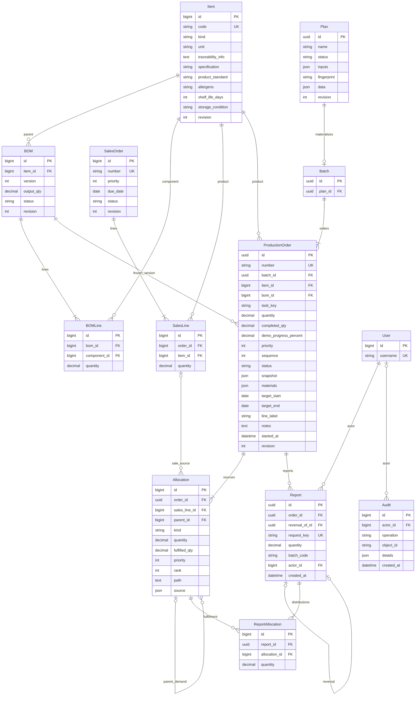
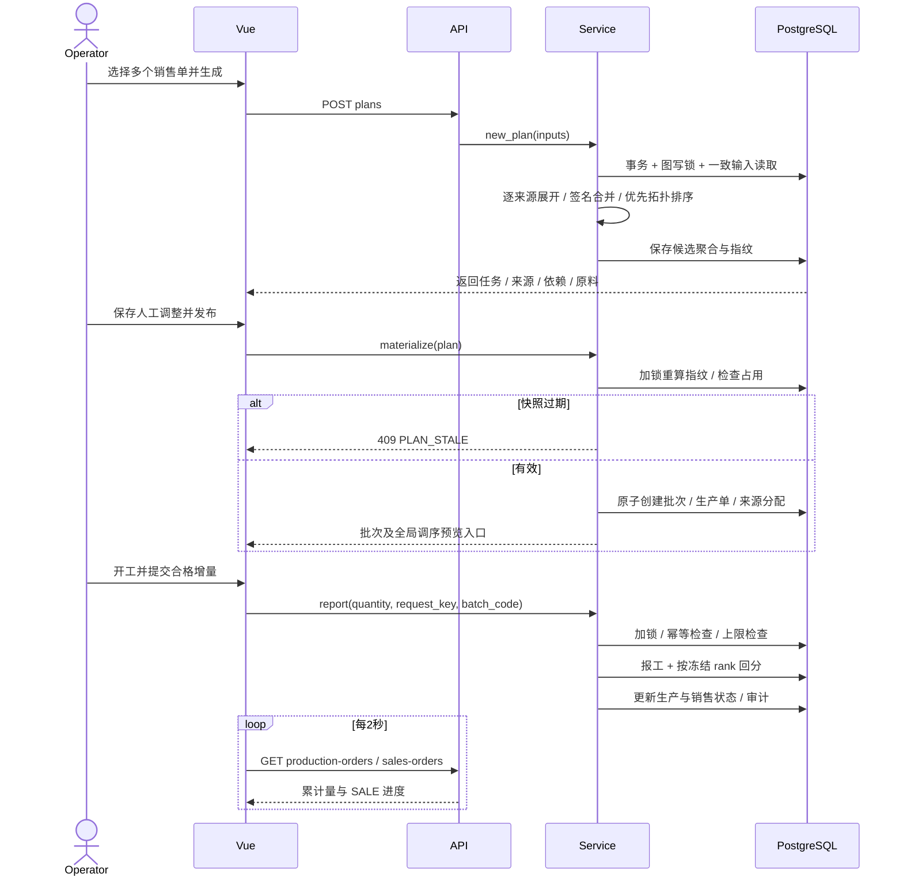
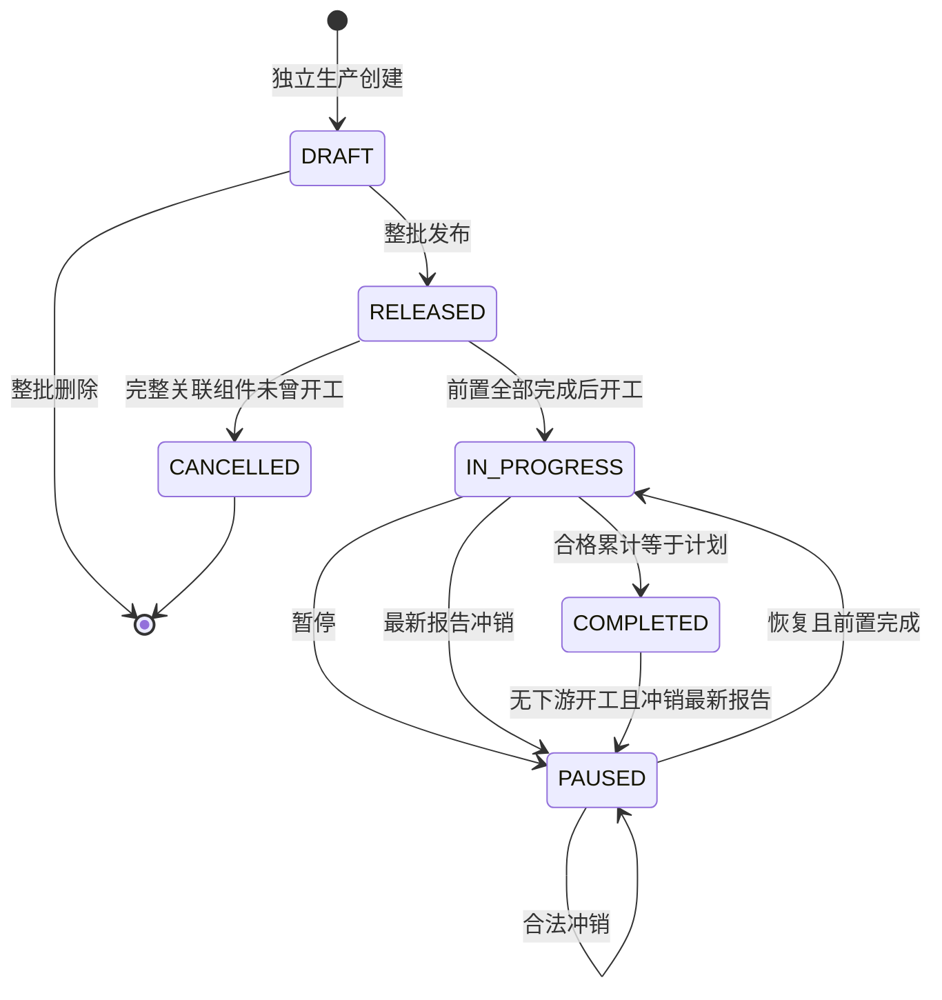

# 最终实现设计、ER 与 UML

版本：1.0｜2026-10-09。01～09 为需求与设计基线；本文件记录本机展示系统的最终实现选择。

## 架构与设计决策

Vue → Django REST Framework Session/CSRF → 领域服务 → PostgreSQL。一个账号拥有全部权限。开发在 `.venv` 与项目内 Node/PostgreSQL 工具运行；部署仍为一个 Docker 容器，内部 PostgreSQL 与 Gunicorn，Vue 静态产物由 WhiteNoise 提供，数据保留在命名卷。

生产服务在同一个事务级 PostgreSQL advisory lock 下读取输入、验证并写入，避免两方案抢占同一需求、BOM 图并发修改与报工超量。展示系统采用一个全局业务写锁，牺牲写并行度以减少复杂度；不引入 Redis/Celery 或多容器。

原有 Item/BOM/Sales 使用 bigint 主键并保留现有数据；新增 Plan/Batch/ProductionOrder/Report 使用 UUID。销售/BOM明细以稳定主键排序替代独立 line_no。所有可编辑主要聚合有 revision；接口提供 revision 时检查冲突，前端编辑自动携带。

**候选方案的任务、来源、原料和依赖保存为 Plan.data JSONB 聚合**，不建立重复的 PlanTask/PlanAllocation/PlanMaterial 表。已发布部分使用真实生产单、分配和报工外键关系；原料需求与制造快照是冻结 JSONB。理由是候选整体重算/整体发布且展示数据量有限，这减少候选表与发布表的双份维护。API 不允许直接写入候选 data/fingerprint。

制造签名按完整可达 BOM 图自底向上哈希，包含版本、单位、溯源和产品展示资料。迭代展开逐来源、逐路径、逐边向上量化6位小数，再按签名合并；依赖以供给→消耗关系做五级优先拓扑排序。超过100000个展开分配节点明确拒绝，不保存截断方案；没有固定层级限制。

## 当前数据库 ER

## UML 服务与实体关系

```mermaid
classDiagram
    class SchedulingEngine {
        +generate(inputs) data_and_fingerprint
        +edge_qty(parent, component, output) Decimal
        +topology(tasks, dependencies) sequence
    }
    class ProductionService {
        +new_plan(inputs) Plan
        +edit_plan(plan, changes) Plan
        +materialize(plan) Batch
        +transition(order, action) ProductionOrder
        +report(order, payload) Report
        +reverse_report(report, key) Report
        +cancel_preview(order) Preview
        +cancel_component(order, token) Preview
    }
    class Plan {
        +UUID id
        +JSON inputs
        +JSON data
        +String fingerprint
        +Integer revision
    }
    class ProductionOrder {
        +Decimal quantity
        +Decimal completed_qty
        +Decimal demo_progress_percent
        +Integer priority
        +String status
        +JSON snapshot
    }
    class Allocation {
        +String kind
        +Decimal quantity
        +Decimal fulfilled_qty
        +Integer rank
        +Integer priority
    }
    class Report {
        +Decimal quantity
        +String request_key
        +String batch_code
    }
    ProductionService ..> SchedulingEngine
    ProductionService ..> Plan
    Plan "1" --> "0..*" ProductionOrder : via Batch
    ProductionOrder "1" --> "1..*" Allocation
    Allocation "0..1" --> "0..*" Allocation : parent demand
    ProductionOrder "1" --> "0..*" Report
```

## UML 发布与报工时序

## UML 生产状态

## 实际接口增量

前缀 `/api/v1/`；全部业务接口需要 Session 登录和写操作 CSRF。

| 接口 | 用途 |
| --- | --- |
| boms/{id}/clone/ POST、tree/ GET | 复制新版本、图关系分层浏览 |
| plans/ GET/POST，plans/{id}/ GET/PATCH/DELETE | 候选方案 CRUD；PATCH 修改 inputs 后整体重算，或 tasks 全量调序 |
| plans/{id}/publish/ POST | 幂等发布完整方案 |
| production-orders/ GET/POST，{id}/ GET/PATCH/DELETE | 生产 CRUD；POST 独立需求草稿；DELETE 整个草稿批次 |
| production-orders/{id}/publish/ POST | 发布草稿完整批次 |
| production-orders/{id}/start/、pause/、resume/ POST | 状态流转；开工/恢复校验前置 |
| production-orders/{id}/report/ POST | quantity、request_key、batch_code、notes；幂等报工 |
| production-orders/{id}/cancel-preview/ GET、cancel/ POST | 完整共享影响预览；提交冻结 token 确认 |
| production-orders/queue/ GET/POST | 全局未开工队列插入建议；token、完整 order_ids、reason 确认调序 |
| reports/ GET、reports/{id}/reverse/ POST | 历史查询、最新报告精确冲销 |
| audit/ GET | 操作审计 |

已发布生产数量/来源等级冻结，允许调整日期、产线和备注；全局顺序通过队列接口修改并留痕，不抢占在制单。草稿根数量改变会重建完整草稿批次，生产 UUID 更新；页面刷新列表后使用新 UUID。候选原料展示汇总仅用于阅读，后端 Decimal 为权威数量。
