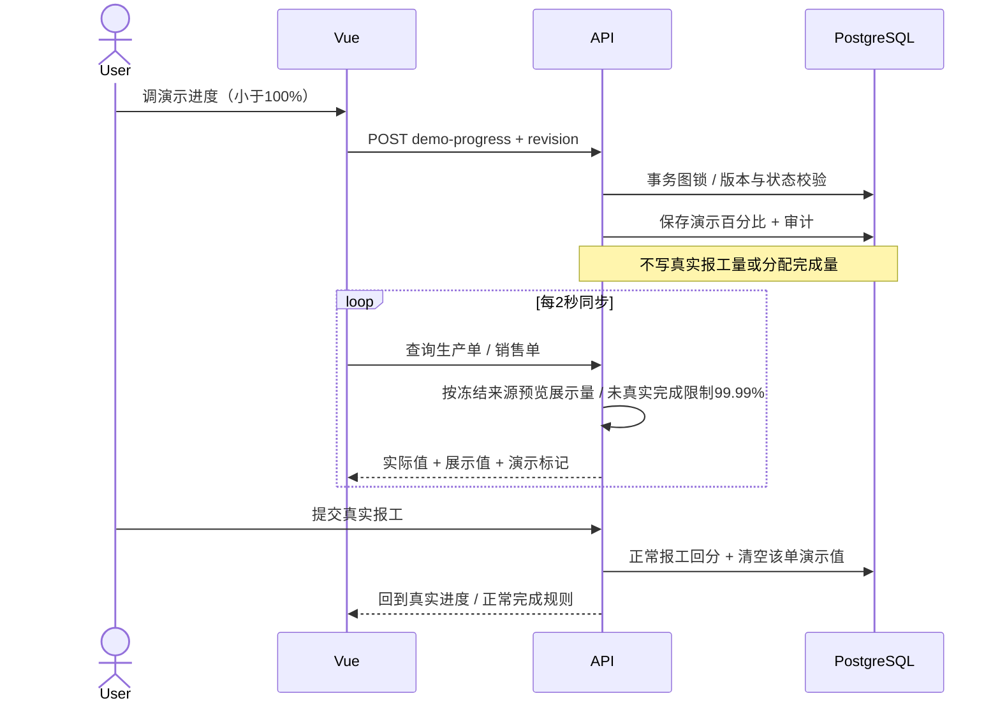

# 演示生产进度调整

日期：2026-10-09。需求：生产单可以手动调进度，反馈到销售单，不能手动调成100%，真实报工完成流程继续有效。

## 操作

进入“排产与生产 → 生产安排与报工”，在待开工、生产中或暂停生产单上点击 **调演示进度**。输入0～99.99%，保存后生产条和关联销售条每2秒同步，并显示“演示进度 / 含演示进度”标记及真实报工量。

- 不能设置100%，前端、API、数据库均限制；不能调低到真实报工进度以下。
- “恢复真实进度”清空演示值，回到现有报工进度。
- 草稿、已完成、已取消生产单不支持设置演示值。
- 新的正常报工或冲销自动清除该生产单演示值，再显示真实进度。相同报工键重试保持幂等，不重复操作。
- 真实报工仍按原计划量报工。演示值不占用真实产量、不改变生产/销售完成状态、不解除前置依赖、不增加报工或回分流水。

半成品演示进度只影响它直接销售的来源；内部组件不会直接计入父产品销售进度。父产品若需演示进度，可以调整其生产单，但开工/报工仍校验真实前置完成状态。

## 来源展示规则

按生产单现有冻结rank预览演示量，先扣实际已回分量，再依次把演示增量展示给剩余来源；不写入Allocation.fulfilled_qty。

例：P1订5 kg、P3订4 kg，合并为9 kg，真实报工0。生产单手调70%对应6.3 kg展示量，来源预览为5 kg及1.3 kg；销售展示分别为99.99%与32.5%，实际完成仍0、状态仍已确认。高优先级虚拟来源即使已填满，也限制低于100%。

随后真实报工6 kg：自动清除演示值，真实回分5/1 kg；P1销售完成100%，P3销售25%。只有这种真实完成允许100%。销售订单真实数量、待排量、状态及累计报工均以原字段为准。

## 数据与接口

ProductionOrder新增可空 `demo_progress_percent numeric(5,2)`，数据库约束0≤值<100。增量迁移不会改动原数据，旧单默认NULL。

`POST /api/v1/production-orders/{id}/demo-progress/`

```json
{"percent": "70.00", "revision": 1}
```

清除时percent传null。revision用于防止多页签覆盖。返回生产单，包括实际 `actual_progress_percent` 和展示 `display_progress_percent`；销售progress增加 `display_percent`、`demo_active`，保留原真实percent/fulfilled/planned/remaining。

演示值独立存储，重启保留；修改记录写入Audit操作DEMO_PROGRESS。取消未开工共享生产组件时也清除对应演示值，释放真实占用不变。



## 验证

test_demo_progress.py覆盖：99.99%上限与非法数值、数据库100%拒绝、跨销售冻结优先级展示、真实台账不变、清除/正常报工/冲销/取消清除、revision冲突、真实报工最终完成、组件不计父销售且不解除开工依赖。

production.spec.ts在真实浏览器中手调70%，另一页签确认销售99.99%/32.5%且未完成；再报工6 kg，验证销售100%/25%和演示标记清除。

2026-10-09实测：本机与Docker后端均51项通过，两边浏览器均4项通过；Docker已更新并保留原演示数据，真实产量/分配/报工数据守恒检查通过。已更新实际ER与UML类图，新增[演示进度时序图SVG](diagrams/rendered/15-demo-progress-01.svg)和[PNG](diagrams/rendered/15-demo-progress-01.png)。
